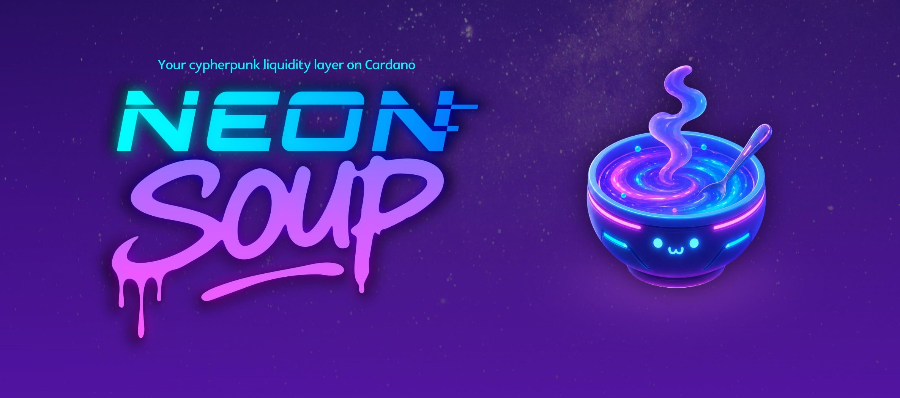

# 🧬 NeonSoup

*Imagine Cardano DeFi without isolated competing kitchens.
No more liquidity trapped in separate pots and no more waiters, gatekeepers, backroom batchers between you and the soup you love.*

*NeonSoup brings the ingredients together into one glowing, shared liquidity soup — always served hot, directly from user devices.
Inspect the recipe. Fork it. Compose your own flavors. Deploy kitchens on your own.*

**Cardano DeFi, the cypherpunk way**

---
## 🍿 Try it live

- **🥣 Neon Soup dapp:**  In development
- **[🛠️ Development dapp](https://neonsoup-dev.netlify.app/):** Tool used for development - WIP

**Not production ready yet! Use only on testnet.**

## 🛠️ Devtool Dapp

The current frontend is a developer tool for testing the P2P DeFi Kernel order
book, GameChanger Wallet intents, and protocol UX before the production
NeonSoup frontend lands. It is a Vite + React + TypeScript app under
[`src/devtool/`](src/devtool/) and builds to `dist/index.html`.

See [`src/devtool/README.md`](src/devtool/README.md) for setup, env variables,
and UI notes.

Provider defaults are configured through Vite env variables. Copy
[`.env.example`](.env.example) to `.env` for local development and keep private
provider URLs/API tokens out of commits.
The devtool app version uses SemVer build metadata:
`package.json` version + `VITE_NEONSOUP_BUILD_TAG`, for example
`0.0.1+local`. Changing the build tag intentionally prompts users to
update/reset incompatible browser state.

## 🚀 Overview

**NeonSoup** is a peer-to-peer execution layer for Cardano DeFi with a deep exploration for cypherpunk values: 

- User First. Protocol execution on user devices. Zero installs. Zero onboarding barrers. For mobile, desktops and the people at the streets.
- Direct user access to a unified, global, shared liquidity. No more silos.
- No middlemen, no exclusive frontends, no centralized order books, no batchers
- Self-sovereign. Design optimized to be inspected, forked and re-deployed on any platform and programming language.
- Composable. Away from the anti-collaborative CIP30 ecosystem (but without leaving any wallet behind!), we will be using UDC open intents. Flows that turn into sealed transactions only at last mile: on user wallets.

---

## ⚡ Core Principles

* **Shared Liquidity**
  Liquidity is unified across participants.
  No silos. No fragmentation.

* **No Centralized Order Book**
  No backend matching engines.
  Users interact directly. 

* **Zero Batchers**
  No sequencers.
  No middle layers.
  Just real-time P2P execution.

* **Client-Side First**
  Execution happens in your wallet.
  You stay in control of the staking of locked funds,of your keys and transactions.

* **User First**
  Dapp suggests, user customize and decide    
  You have the final word
  You are the owner

* **By the community, for the community** 
  Don't expect us to be yet another DeFi "bank". If you only trust million-dollar corporations to gatekeep your liquidity and profit from your trust delegation, this project is not for you. NeonSoup is designed to be culturally-owned by you. Your own door to shared liquidity, your open source contributions, your profit opportunities, you.

---

## 🧱 Architecture

### ⛓️ On-chain

* **P2P DeFi Kernel validators**

  * Run on Cardano (Layer 1)
  * Enforce swap conditions
  * Validate commitments
  * Settle results trustlessly

---

### 💻 Off-chain (User Device)

* **Neon Soup Frontend**

  * Intent creation
  * Manual/automatic matching coordination
  * UDC online/air-gapped connection

* **GameChanger Wallet**

  * Intent execution
  * Automatic matching for static intents

All logic runs locally in the user device.

---

### 🔗 UDC — Universal Dapp Connector

* Enables **reusable intent-based integrations** via:

  * URLs
  * QR codes
  * NFC tags

👉 Eject any frontend. Swap anywhere. Anytime. Even on the streets.

---

### 📦 GCFS — On-chain file system protocol on Cardano

* Code is:

  * Read
  * Written (maintained, updated)
  * Cryptographically verified
  * Composed

Immutable. Permissionless. Composable.

---

## 🧩 Composability in Mind

For the same liquidity, NeonSoup exposes 
* open, 
* modular, 
* composable intents.

> Bring your own distinctiveness into The Global Soup.

---

## 🧠 Cypherpunk by Design

* Minimizes centralized points of failure
* Open, permissionless, and verifiable
* Censorship-resistant by design
* Data integrity via GCFS (on-chain storage)
* User sovereignty over keys and data
* Composable primitives for "infinite" DeFi

---

## 🛠 Tech Stack

* **Cardano L1** — settlement layer
* **P2P Validators** — on-chain enforcement
* **Ejectable frontend** — Simple web app with no specialized, custom backend
* **UDC** — Universal Dapp Connector
* **GCFS** — on-chain protocol library distribution
* **GameChanger Wallet** — client side execution environment. All wallet types supported, even hardware and browser extension wallets.

---

## 🌐 Links

* P2P DeFi Kernel hashes: https://github.com/fallen-icarus/cardano-swaps/blob/main/VERSIONS.md
* Github: https://github.com/GameChangerFinance/NeonSoup
* Website: https://gamechanger.finance

---

## 🙌 Acknowledgements

* To *Fallen Icarus*, *P2P DeFi Kernel* should have been *The Way* years ago. Here we are trying to contribute to your cause.
* To *Agustin Badi*, for teaming up on a demo at our presentation at *CF Open Dev Hours* about *UDC* and intent-based dapps (17/04/2026). That PoC inspired this project.
* To *Gimbalabs* for proving competition in Web3 is useless with the *Piece of the Pie "Collaborathon"*

---

## 🧨 Final Thought

*Web3 liquidity should be a self-sovereign, collective, collaborative phenomenon*

**NeonSoup aims to be the modern primordial soup to help bootstrap this culture**
